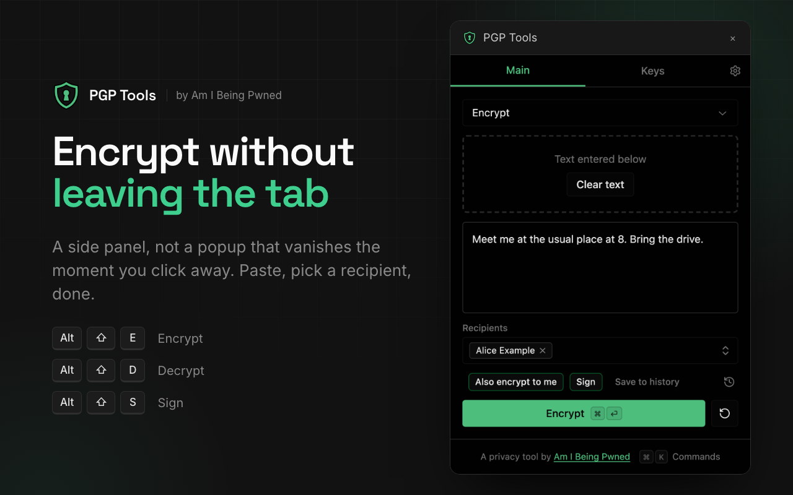
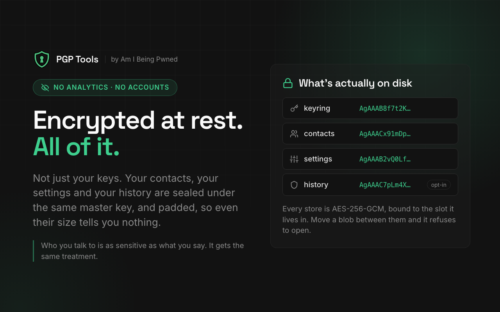
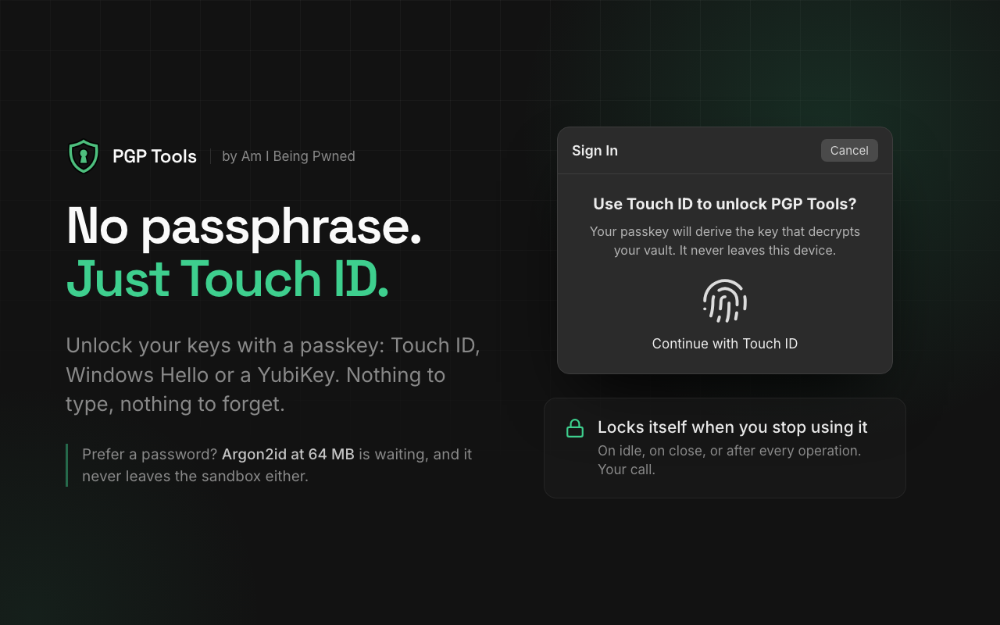
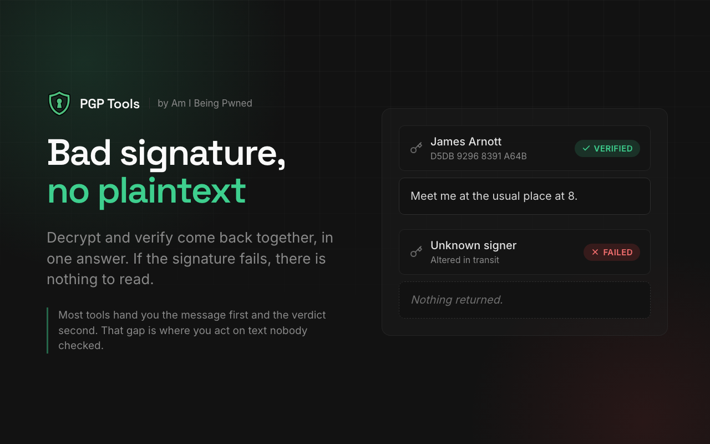
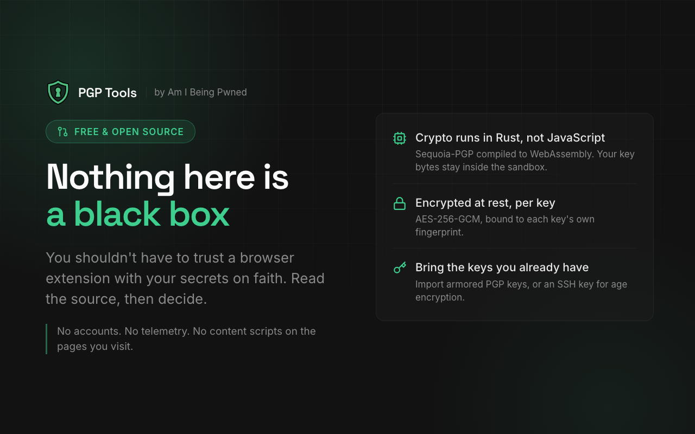

<p align="center">
  
</p>

<h1 align="center">PGP Tools</h1>

<p align="center">
  Open-source browser extension for PGP & AGE encryption and decryption.<br/>
  Built with Rust/WebAssembly. Private keys never touch the JS heap unless they have to.
</p>

<!-- badges:start -->
<p align="center">
  <a href="https://github.com/Am-I-Being-Pwned/PGP-Tools/actions/workflows/ci.yml"></a>
  <a href="https://chromewebstore.google.com/detail/pgp-tools-encrypt-decrypt/pgpcdgggohpbombhkffjoiiafdlfcpgp"></a>
  <a href="https://chromewebstore.google.com/detail/pgp-tools-encrypt-decrypt/pgpcdgggohpbombhkffjoiiafdlfcpgp"></a>
  
  
  
</p>
<!-- badges:end -->

<p align="center">
  <a href="https://chromewebstore.google.com/detail/pgp-tools-encrypt-decrypt/pgpcdgggohpbombhkffjoiiafdlfcpgp"></a>
  &nbsp;
  <a href="https://microsoftedge.microsoft.com/addons/detail/pgp-tools-encrypt-decr/ngdbamkfldpokifphlmbflhoaepkcehf"></a>
</p>

<p align="center">
  
</p>

## Why PGP Tools?

**Open source and transparent.** Most PGP browser extensions are closed source. You shouldn't trust a black box with your secrets.

**Crypto runs in WASM, not JavaScript.** All PGP operations run in a Rust/[Sequoia-PGP](https://sequoia-pgp.org/) WebAssembly sandbox. JS holds only an opaque integer handle to your key - the actual bytes live in WASM linear memory and are zeroized on drop. Private keys briefly pass through JS during generation and import before being encrypted and stored.

**Passkey unlock.** Protect keys with WebAuthn PRF - unlock with Touch ID, Face ID, Windows Hello, or a YubiKey instead of a password. The PRF output is combined with a stored secret via HKDF-SHA256, and the entire unlock flow runs in WASM.

**Argon2id for passwords.** 64 MB memory, 3 iterations - GPU brute-force resistant. The KDF, decryption, and key storage all happen in WASM. Password bytes are zeroed on both sides immediately after use.

**Atomic decrypt + verify.** Plaintext and signature result are returned together in a single packed response. Bad signature = no plaintext returned. No TOCTOU window.

**Zeroization everywhere.** `zeroize` crate on all stored keys and intermediates (Rust). `Uint8Array.fill(0)` on passwords, PRF outputs, and derived keys (JS). WASM memory isn't GC'd, so zeroization is deterministic.

**Per-key AAD.** Each private key is encrypted with AES-256-GCM using Additional Authenticated Data bound to its fingerprint. Swapping blobs between key slots fails.

<table>
  <tr>
    <td width="50%"></td>
    <td width="50%"></td>
  </tr>
  <tr>
    <td width="50%"></td>
    <td width="50%"></td>
  </tr>
</table>

## Features

- ECC (Cv25519) or RSA-4096 key generation
- Encrypt to multiple recipients, with optional signing
- Decrypt with automatic signature verification
- Cleartext sign and verify
- Import/export armored keys
- One-file backup: export/import all keys and contacts (passphrase-encrypted by default)
- Sign & verify Chrome extension packages (`.crx`) for the Web Store's Verified CRX Uploads (optional; off by default)
- age encryption with an SSH key you already have - import an `ssh-ed25519` or `ssh-rsa` key and encrypt/decrypt [age](https://age-encryption.org/) files (binary or armored), cross-checked against the Go `age` CLI. Import only (the app never generates SSH keys); encrypt/decrypt only (age has no signing). Native `age1…` keys are out of scope, and ECDSA, DSA and FIDO `sk-*` keys are rejected
- Right-click context menu on selected text
- Auto-lock on inactivity, panel close, or per-operation (never-cache mode)
- Optional Chrome sync or local-only storage

## Security model

| Layer | Mechanism |
| --- | --- |
| Crypto engine | Sequoia-PGP in WASM (keys in JS only during gen/import) |
| Second engine | age in the same WASM sandbox, to imported SSH keys only - no signing, no key generation. An age file names the SSH public key it was encrypted to, so it is linkable to that key |
| Key unlock | WebAuthn PRF (passkeys) or Argon2id 64 MB (passwords) |
| Key storage | AES-256-GCM with per-key AAD - one shared envelope for PGP, CRX and SSH keys, with a distinct AAD prefix per key type |
| Memory | `zeroize` crate (Rust) + manual zeroing (JS) |
| Signatures | Atomic decrypt+verify (no TOCTOU) |
| Sessions | Auto-lock on inactivity, panel close, or per-op |
| Brute-force | Argon2id 64 MB / 3 iterations - the cost sits in the KDF, which also holds against an offline attack on a stolen blob |
| Scope | No content scripts - extension sandbox only |

## Stack

- **PGP**: Rust / [Sequoia-PGP](https://sequoia-pgp.org/) / WebAssembly
- **age**: Rust / [`age`](https://crates.io/crates/age) + [`ssh-key`](https://crates.io/crates/ssh-key) / WebAssembly - `ssh-ed25519` and `ssh-rsa` recipients only
- **Extension**: [WXT](https://wxt.dev/) + React + Tailwind
- **Key protection**: WebAuthn PRF or Argon2id + AES-256-GCM
- **UI**: shadcn/ui

## Getting started

### Requirements

- Node ^22.21.0, pnpm ^10.19.0
- [Rust](https://rustup.rs/) + [wasm-pack](https://rustwasm.github.io/wasm-pack/installer/)

### Setup

```bash
pnpm install
pnpm dev        # dev server with hot reload
pnpm test       # unit tests (vitest); Rust engine tests: cargo test in apps/pgp/gpg-wasm
pnpm build      # production build (builds WASM automatically)
pnpm zip        # package for Chrome Web Store / Firefox Add-ons
```

The WASM module must be built from source. To rebuild manually:

```bash
cd apps/pgp && pnpm build:wasm
```

## Project structure

```
apps/pgp/              Extension source
  components/           React UI
  entrypoints/          background + sidepanel
  hooks/                keyring, sessions, contacts
  lib/pgp/              WASM wrapper + operations
  lib/protection/       WebAuthn PRF, Argon2id, AES-256-GCM
  lib/storage/          chrome.storage with mutex
  gpg-wasm/             Rust/WASM engine (sequoia-openpgp)
packages/ui/            shadcn/ui components
tooling/                eslint, prettier, tailwind, tsconfig
```

## AI disclosure

Built with significant AI assistance (Claude). UI, React plumbing, storage, and extension wiring were largely AI-generated.

The cryptographic implementations - Rust/WASM engine, key protection, WebAuthn PRF, Argon2id configuration - were **human-designed and human-reviewed**. We don't trust vibes-based crypto.

## License

MIT
